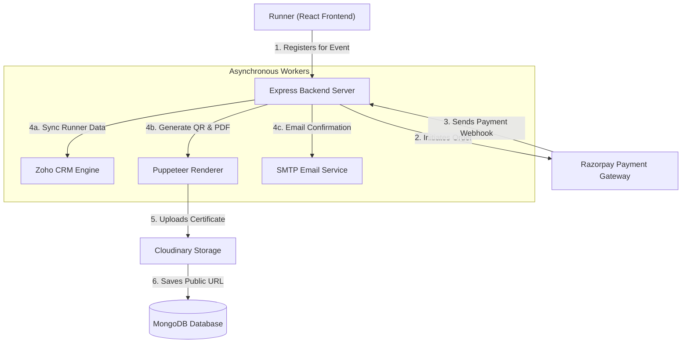

# Case Study: Marathon Event Management System
## Full-Stack Marathon Event Management Platform

### 1. Project Overview
This project is a comprehensive Full-Stack Marathon Event Management System designed to handle large-scale athletic events. The platform simplifies the entire lifecycle of a marathon—from runner registration and secure payment handling to dynamic bib/certificate generation and organizer administration.

### 2. Problem Statement
Organizing a marathon involves handling thousands of participants, complex race categories, secure payments, and manual runner tracking. Runners face checkout friction, delayed confirmations, and slow certificate distribution, while organizers struggle with scattered participant data and manual sync tasks.

### 3. Objectives
* **Streamline Registrations:** Enable runners to register and pay in under a minute.
* **Automate Certifications:** Instantly generate verified digital certificates and QR codes.
* **Centralize Operations:** Provide administrators with a dashboard to track payments, results, and notifications.
* **Sync CRM Systems:** Automatically push registration logs to external CRM platforms for seamless marketing.

### 4. My Role
As the Full Stack Developer, I designed the database schema, built the REST API services, engineered the responsive user interface, and integrated third-party platforms (Razorpay, Zoho CRM, Cloudinary). I also set up automated background tasks and deployed the unified monorepo.

### 5. Tech Stack
* **Frontend:** React, Vite, Tailwind CSS, GSAP
* **Backend:** Node.js, Express
* **Database:** MongoDB Atlas (Mongoose ODM)
* **Authentication:** JWT, bcrypt
* **Payment Gateway:** Razorpay API
* **Email Provider:** Nodemailer (SMTP)
* **Storage:** Cloudinary
* **Deployment:** Render (`render.yaml`)
* **Libraries:** Puppeteer (PDF rendering), `qrcode` (QR Generation), Zoho CRM SDK

### 6. Implemented Features
* **Interactive Frontend:** Slick landing page, dynamic registration forms, and interactive runner dashboards.
* **Razorpay Payment Integration:** Real-time webhooks verify signatures and confirm payments instantly.
* **Automated QR & Certificates:** Generates digital runner certificates containing unique verification QR codes.
* **Admin Dashboard:** Tracks overall sales, registration volumes, and details of background Zoho CRM synchronization logs.
* **Multi-Channel Notification Core:** Configurable engine built to dispatch confirmation emails on successful payment.

### 7. Workflow & System Architecture
Below is the data flow highlighting the registration process, payment verification, and asynchronous task execution:

### 8. Step-by-Step Registration & Processing Flow
1. **Submit Registration:** Runner fills out their details, selecting from multiple race categories (e.g., 5K, 10K, Half-Marathon).
2. **Execute Payment:** The frontend triggers the Razorpay SDK widget to securely collect payment.
3. **Webhook Verification:** Razorpay sends a payment payload. The backend validates the cryptographic signature to confirm authenticity.
4. **Data Synchronization:** The CRM synchronization utility logs the registration details into Zoho CRM in the background.
5. **Certificate Rendering:** Puppeteer compiles an HTML template dynamically into a PDF certificate containing a custom QR verification code.
6. **Cloud Storage Upload:** The PDF is uploaded to Cloudinary, and its URL is saved to the database.
7. **Email Dispatch:** Nodemailer sends a dynamic confirmation email to the runner with their ticket details and certificate download link.

### 9. Challenges Faced
* **Zoho CRM Rate Limiting:** Heavy registration spikes risked hitting API rate limits. I built a resilient sync queue that processes requests asynchronously and logs status entries.
* **Heavy PDF Generation:** Generating PDFs dynamically via Puppeteer is processor-heavy. I moved PDF rendering to a non-blocking background queue and stored results in Cloudinary for persistent access.

### 10. Results
* **Frictionless Signup:** Reduced average signup time to under 60 seconds.
* **Zero Manual Effort:** Automated 100% of certificate rendering and email dispatch workflows.
* **Unified Records:** Synced all registration logs instantly to Zoho CRM without manual data transfers.

### 11. Key Learnings
* **Cryptographic Signatures:** Gained experience protecting APIs against spoofing by validating webhook signatures.
* **Asynchronous Design:** Handled long-running tasks asynchronously to ensure the user interface remains responsive.
* **Robust Integrations:** Mastered the coordination of multiple third-party tools into a single event workflow.

### 12. Future Improvements
* **Live Tracker:** Real-time checkpoint tracking for runners during live races.
* **SMS & WhatsApp Alerts:** Send updates and race day details via mobile notifications.
* **Offline Scanner:** A lightweight check-in tool for event organizers to verify runner QR codes offline.
