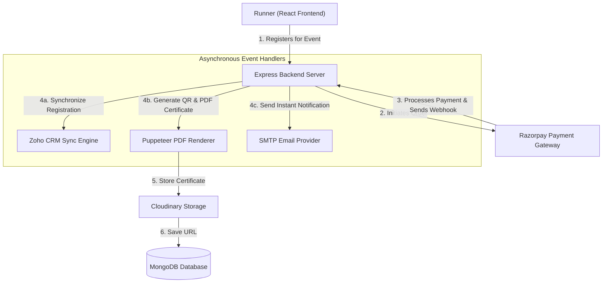

# Case Study: STRIDEFORGE Events
## Full-Stack Marathon Event Management System

### 1. Project Overview
STRIDEFORGE Events is a full-stack Marathon Event Management System designed to handle premium marathon event series in India. I built this platform to simplify the registration, payment, and post-event experience for runners, while giving event organizers a robust, automated system to manage participants, payments, and results.

### 2. Problem Statement
Organizing a marathon involves handling thousands of participants, dynamic ticketing, complex payment collection, and manual result processing. Runners often experience friction during checkout, delays in receiving confirmation emails, and long wait times for digital certificates and race results.

### 3. Objectives
* **Seamless Checkout:** Build a secure, fast registration and payment flow for runners.
* **Process Automation:** Automate the generation of race confirmations, QR codes, and digital certificates.
* **Centralized Administration:** Create a dashboard for real-time tracking of payments, registrations, and sync processes.
* **Data Integration:** Ensure data consistency by integrating registrations directly with third-party CRM platforms.

### 4. My Role
As the sole Full Stack Developer on this project, I was responsible for the end-to-end development of the platform. My responsibilities included designing the database schema, building the RESTful backend API, creating the responsive frontend user interface with modern micro-animations, integrating third-party services (payment, CRM, and cloud storage), and deploying the application.

### 5. Tech Stack
* **Frontend:** React, Vite, Tailwind CSS, GSAP (Animations)
* **Backend:** Node.js, Express
* **Database:** MongoDB Atlas, Mongoose ODM
* **Authentication:** JSON Web Tokens (JWT) & bcrypt password hashing
* **Payment Gateway:** Razorpay API
* **Email & Notifications:** Nodemailer (SMTP)
* **Asset Storage:** Cloudinary
* **Deployment:** Render (Infrastructure-as-Code with `render.yaml`)
* **Other Tools:** Puppeteer (PDF certificate generation), Zoho CRM SDK (Data sync)

### 6. Key Features
* **User Registration & Authentication:** Secure account creation and login with role-based access control.
* **Online Registration & Payments:** Multi-tier ticket selection integrated with Razorpay for secure checkout.
* **QR Codes & Digital Certificates:** Automatic certificate generation using Puppeteer (HTML to PDF) and dynamic QR codes for verification.
* **Admin Dashboard:** Real-time analytics for registration volumes, sales, Zoho CRM sync logs, and certificate distribution.
* **Notification System:** Multi-channel system supporting instant email confirmations upon successful payment.

### 7. Workflow & Architecture
Below is the system workflow highlighting the registration process, payment verification, and asynchronous task execution:

### 8. Detailed Registration Process
1. **Selection & Registration:** The runner selects a race category and submits details via a dynamic form.
2. **Secure Payment Checkout:** The frontend initiates the Razorpay SDK. Once the user pays, Razorpay fires a secure webhook callback to the backend.
3. **Verification & State Update:** The backend verifies the cryptographic signature of the webhook, marks the payment as successful, and generates a unique registration ID.
4. **CRM Synchronization:** The registration details are pushed to Zoho CRM via the API SDK to update sales logs.
5. **PDF & QR Generation:** Puppeteer generates a digital invoice and certificate containing a verification QR code, which gets uploaded to Cloudinary.
6. **Notification Dispatch:** An automated email containing the receipt, QR code, and certificate link is sent to the runner.

### 9. Challenges Faced
* **Data Synchronization at Scale:** High registration volumes could cause rate-limiting issues when syncing data with Zoho CRM. I solved this by implementing a robust retry queue and background sync logs to ensure zero data loss.
* **PDF Generation Overhead:** Generating high-resolution digital certificates with Puppeteer was resource-intensive. I resolved this by generating the PDFs asynchronously, storing them on Cloudinary, and caching URLs in MongoDB.

### 10. Results
* **Under 60 Seconds:** Reduced registration checkout time to under a minute with the Razorpay integration.
* **100% Automated:** Automated certificate generation and delivery, removing days of manual organizer effort.
* **Real-time CRM Sync:** Maintained real-time data sync with Zoho CRM, allowing the marketing team to engage runners immediately.

### 11. Key Learnings
* **Security & Webhooks:** Learned how to safely handle payment verification using secure cryptographic signatures and webhooks.
* **Background Tasks:** Mastered asynchronous processing in Node.js to keep the user interface responsive during heavy backend operations.
* **System Integration:** Gained practical experience in connecting disparate services (payment, storage, notifications, CRM) into a cohesive workflow.

### 12. Future Improvements
* **Live Runner Tracking:** Add GPS integration or RFID checkpoint sync to track runners in real time on the web app.
* **Multi-channel Notifications:** Expand the notification engine to send registration and BIB info via WhatsApp and SMS.
* **Offline Check-in Mode:** Build a companion mobile app view for on-site organizers to scan participant QR codes offline.
